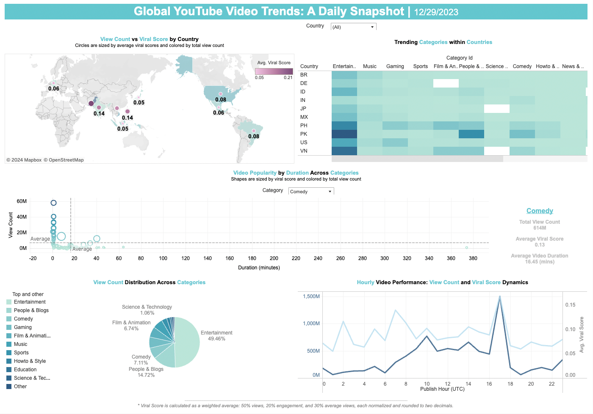
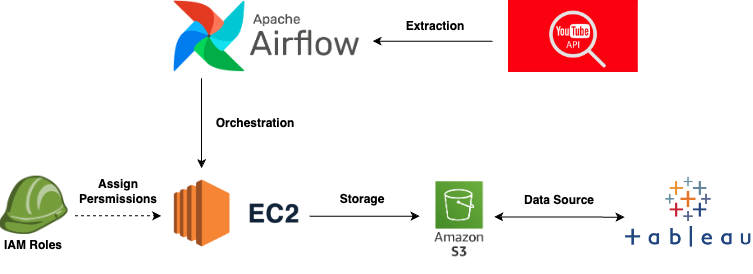

# YouTube Video Trends Analytics 

## Introduction
This project demonstrates a data engineering workflow for YouTube analytics using Apache Airflow for automating the Extract, Transform, Load (ETL) and data processing tasks. Airflow is hosted on an AWS EC2 instance, and the processed data is stored in an Amazon S3 bucket. For visualization and analysis, the data is made accessible through Tableau, connecting directly to the S3 bucket.

### Key Features
- **Automated ETL Process**: Utilizes Apache Airflow to automate the data pipeline.
- **Cloud Integration**: Hosted on AWS EC2 for reliable and scalable performance.
- **Data Storage**: Data is stored in an AWS S3 bucket, ensuring secure and scalable storage.
- **Data Visualization**: Integration with Tableau for insightful and interactive data visualizations.

## Tableau Dashboard

[Global Youtube Video Trends Dashboard](https://public.tableau.com/app/profile/kai.yin.chan/viz/GlobalYoutubeVideoTrends/GlobalYoutubeVideoTrends)

### Dashboard Features
- **Global View:** A world map highlighting the view counts and viral scores by country, offering a snapshot of video popularity across the globe.
- **Trending Categories:** A heatmap showcasing the trending video categories within selected countries, enabling users to spot trends quickly.
- **Category Distribution:** A pie chart displaying the view count distribution across different YouTube categories.
- **Popularity by Duration:** A scatter plot correlating video duration with popularity, sized by viral score and colored by total view count.
- **Hourly Video Performance:** A line chart tracking hourly video performance, analyzing view count and viral score dynamics over time.

## Workflow


### Technologies Used
- **Apache Airflow**: For orchestrating the ETL pipeline.
- **AWS EC2**: Hosting the Airflow instance.
- **AWS S3**: For data storage.
- **Tableau**: For data visualization.

## Getting Started

### Cloning the Repository
To use this project, start by cloning the repository to your local machine:
**Clone the repository** by running:
```sh
$ git clone https://github.com/carolyntw/YouTube-analytics.git
```

### Prerequisites
- AWS Account with EC2 and S3
- Apache Airflow setup
- Tableau Desktop or Server

### Installation and Setup
1. **Setting up AWS EC2 Instance:** Follow AWS documentation to set up an EC2 instance.
2. **Configuring Apache Airflow:** Install and configure Airflow on the EC2 instance.
3. **S3 Bucket Creation:** Create an S3 bucket for data storage.
4. **Tableau Configuration:** Set up Tableau to connect to the S3 bucket.

## Usage

### Starting the Airflow DAGs
1. Access the Airflow web interface on your EC2 instance.
2. Authenticate and navigate to the DAGs section.
3. Locate and trigger the YouTube Analytics DAG.

### Accessing Processed Data in S3
1. Log into AWS Management Console and go to the S3 section.
2. Locate and interact with the data in the designated bucket.

### Visualizing Data with Tableau
1. Open Tableau and connect to the data source in S3.
2. Import datasets and create visualizations using Tableau's tools.